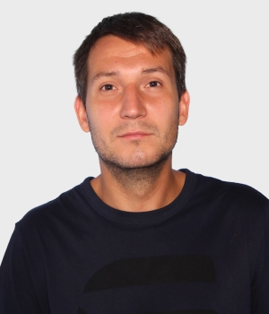

# Viacheslav Chuvalskyi

# Contacts
> ### slavachuval@gmail.com 
> ### +38 (063) 431-25-87
>

# About Myself:
It has become apparent in recent years that future is under IT technologies and I would like to be a part of them. On my opinion work in IT field is a challenge, because you should always be in touch with new technologies, trends and development of marketplace. Therefore, it’s allowed you to develop yourself and set a new goals every year, it cannot be the same like it was in previous years.
 
I have had more than three years of experience in 1c programming that get me some understandable rules of programming and acceptable methods for solving tasks and goals.  My major goal for near future is to realize myself in Frond-End Developing. I would like to get more experience and knowledge in this area for getting more professional programmer.
>

# Work experience

>## **1С Programmer**
>### PE Sartinskyi A.
01/2018- present  Kyiv, Ukraine

* Achievements / Objectives
   - Setting up and maintaining 1C data exchanges with the server
   - Development and implementation of new functionality in various 1C configurations
   - User support
>
>## **Travel Agency Director**
>### PE Chuvalskyi V.
11/2015-02/2017 Kyiv, Ukraine

* Achievements / Objectives
   - General management of the company
   - Organization and control of sales process
   - Recruiting and management of personnel
   - Financial management of the company
   - Administrative and technical support of the company

>
>## **Senior manager of a network of gambling establishments**
09/2009-12/2016 Kyiv, Ukraine 

* Achievements / Objectives
   - General management of the network of establishments
   - Recruiting and management of personnel

>
>## **Senior Operator of the gambling machine hall**
>>>### Laguna-2004 LLC
06/2006-06/2009 Kyiv, Ukraine

* Achievements / Objectives
   - Monitoring the performance of gambling machines
   - Communication with customers  
   - Organization of personnel management  
   - Inspection, maintenance and repair of slot machines 

>>
>## **Operator of the gambling machine hall**
>>>### MDK LLC
04/2004-10/2006 Kyiv, Ukraine

* Achievements / Objectives
   - Monitoring the performance of slot machines
   - Communication with customers  
   - Inspection, maintenance and repair of slot machines  

>>
>## **System Administrator**
>>>### Agro-Center LLC
09/2002-02/2003 Kyiv, Ukraine 

* Achievements / Objectives
   - Setting up computers and networks
   - Testing and modernization of computers and programs  

>
>
# Extra skills
  
   * Сonfident knowledge
     * HTML
     * CSS/SCSS
     * JavaScript
     * Figma 
     * GitHub
     
   * development experience in the project
        * JQuery
        * Bootstrap     
        * Pug 
        * NodeJS 
        * Gulp 
        * Express 
        * Vue
        * Vuex
        * React
        * MongoDB  
        
# Work examples
   
   [Landing page](https://viacheslavchuvalkiy.github.io/WebDad-project-1/)
   
   [My repositories](https://github.com/ViacheslavChuvalkiy?tab=repositories)
   
# Languages

### Ukrainian – native,
### Russian - native, 
### English - upper intermediate